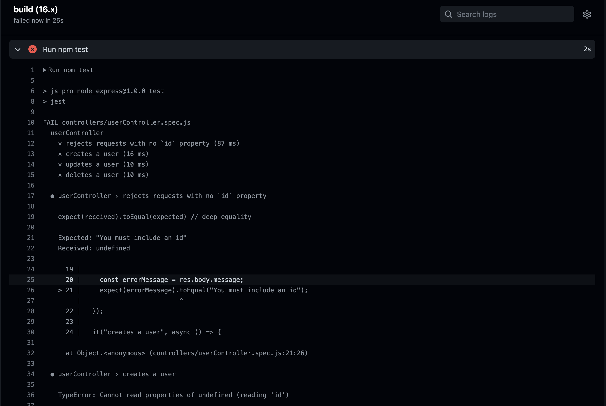

# Node Express Starter

---

## Getting Started

---

`nvm use` (make sure you have node version manager installed)

`npm install`

`npm start`

`npm run dev` to start with hot reloading

`npm test`

---

## How To Use

---

You'll see many comments throughout the codebase which highlight common patterns and libraries.

There are 4 routes you can reach from your localhost like so:

[GET] `http://localhost:5000/user`

[POST] `http://localhost:5000/user`

[PUT] `http://localhost:5000/user`

[DELETE] `http://localhost:5000/user`

---

## Examples:

---

To create a new user
[POST] http://localhost:5000/user

Payload:

```js
{
    "id": "123",
    "email": "brianjenney83@gmail.com",
    "name": "brian"
}
```

To get a user with an id of 123:
http://localhost:5000/user/123

---

### Further Reading

---

CORS: https://developer.mozilla.org/en-US/docs/Web/HTTP/CORS

REST Architecture: https://restfulapi.net/

---

# One Small Problem 🤏

---

Oh no, it looks like our tests pass locally but not during our Github build using Github Actions?! What gives?



- Fork this project
- Run the tests locally (follow the instructions above)
- Add a commit to see the Github Actions get triggered which run the test suite
- Fix the issue(s)?

---

📼
Here's a short walkthrough of Github Actions and the problem we are experiencing: https://www.loom.com/share/ac1961e48b494f609834e2874d773bf1

---

What was the root of the issue? How might a dev team avoid this embrrassing mistake in the future?
