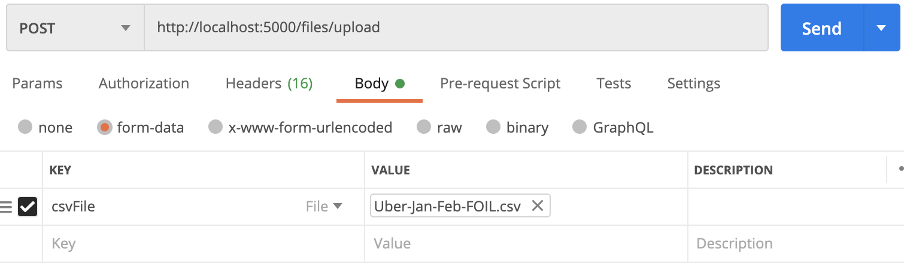

# Node Express Starter

---

Video Walkthrough => https://www.loom.com/share/b1a7cbc0f57444a281047eba2c42fe1c

A barebones node express app with some basic CRUD operations using an object in place of a database. Includes unit tests using `supertest` https://www.npmjs.com/package/supertest

---

## Architecture

---

This app uses a common pattern of having `controllers` and `routes` in separate folders.

Controllers are used to manipulate and query data.

Routes simply listen for requests on certain paths and provide methods which are called on those routes.

Middlewares are methods that are called before the request goes to a controller. In this app, we have a `validateUserBody` middleware which ensures all incoming requests have an `id` property - if they DO NOT, we simply reject the request - if they DO, we continue the request using `next`

---

## Getting Started

---

`npm install`

`npm start`

`npm run dev` to start with hot reloading [this will not work until you complete the challenge]

`npm test`

---

## How To Use

---

You'll see many comments throughout the codebase which highlight common patterns and libraries.

There are 5 routes you can reach from your localhost like so:

[GET] `http://localhost:5000/user`

[POST] `http://localhost:5000/user`

[PUT] `http://localhost:5000/user`

[DELETE] `http://localhost:5000/user`

---

### For uploading files

---

[POST] `http://localhost:5000/files/upload`

---

### Examples:

---

**To create a new user**

[POST] http://localhost:5000/user

Payload:

```js
{
    "id": "123",
    "email": "brianjenney83@gmail.com",
    "name": "brian"
}
```

**To get a user with an id of 123:**

http://localhost:5000/user/123

**To upload a file using a tool like postman:**

Video Walkthrough: https://www.loom.com/share/0b3645c2c5b94311961d606f9ae22bd3

You can use an example csv file at `mockData/uber_jan_feb.csv`



---

### Further Reading

---

CORS: https://developer.mozilla.org/en-US/docs/Web/HTTP/CORS

REST Architecture: https://restfulapi.net/

---

## TODO

---

Do a search for any use of the evil `any` type and all `TODO`s which are located in the controller files. Developers will often 'cheat' by using the `any` type to avoid defining types. I mean, what's the point of using TS if you're going to avoid types in the first place.

Next, look up TypeScript generics. What are they? Why might they be useful in this project or any TS application?.

Lastly, what the `tsconfig.json` file doing?
