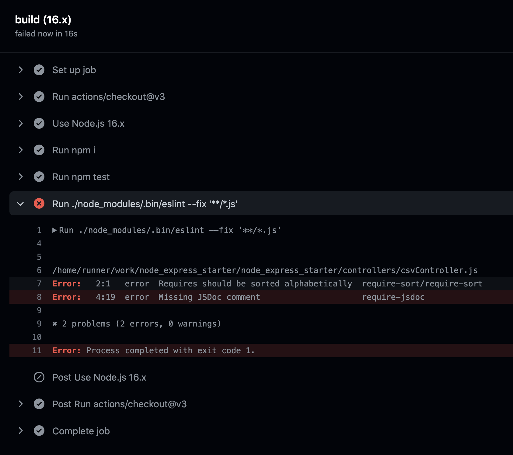
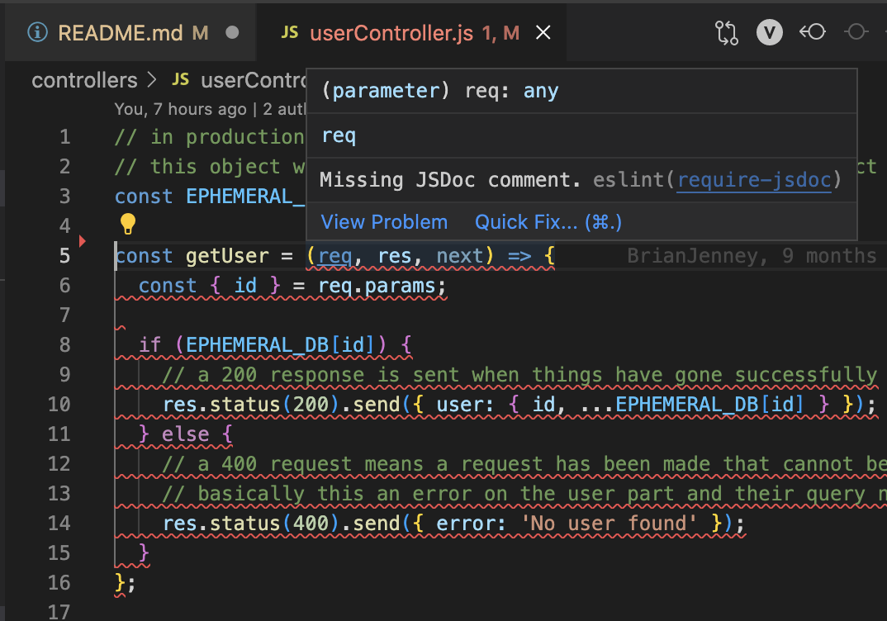

# Enforcing Coding Styles and Rules

---

Writing good code is one thing... keeping it that way is another.

You have a few options on a software team to maintain code quality:

1. Peer Reviews
2. Automated quality checks
3. Code guideline documents

I personally like to use a combination of all 3 options. Linters are a great solution to maintain standards and rules across a codebase which allows developers to focus on the important pieces of logic rather than whether to use tabs or spaces... tabs btw.

**So What is a linter?**

A linter is an automated analyzing of your source code to look for bugs and stylistic errors.

Check out `.eslintrc.js` for an example of a linter for a NodeJS project.

This particular project enforces @jsdoc notation (basically a style of commenting for functions), single quotes and alphabetical imports among other things.

**Check out this video walkthrough:**

https://www.loom.com/share/466eb771e07d45c9ac5786fc347018e5

---

### TODO

---

Ruh roh, our build is failing.



To replicate the scenario - first fork this repo.

To start the project:

```js
npm i
npm start
```

Navigate to `./controllers/userController.js` and fix the linter error for `getUser`



Now push your changes up to your local remote branch

```js
git add .
git commit -m "fixed error"
git push
```

You may notice some actions happening when you run the commit command. There is a library `husky` which can intercept the git commands and run some side effects. In this case we are running `eslint` on all `staged` files.

You may notice your build still fails?! What gives?

---

_Challenge 1_

---

Update the `.husky/pre-commit` to run the linter on ALL files instead of just the ones that are `staged` or changed.

Next, make sure all tests run before each commit.

Now fix all remaining errors and fix the pipeline.

---

_Challenge 2_

---

Add a new rule to the `.eslintrc.js` file to show an error when a developer uses a `forEach` method instead of a `for...of` method.

Hint: Look up the `unicorn` linting package and figure out how to use it for this purpose 🦄.

---

**Food for thought**

---

1. Sometimes you walk into a massive project which is a mess. Adding a linter that's too aggressive can do more harm than good. How might you approach this situation where you want to set some standards but not block developers from working and having to clean up files they haven't touched?

2. It's always good to ask why. What is the point of using a linter? Random rules? What are some of the benefits you can see from using a linter?
