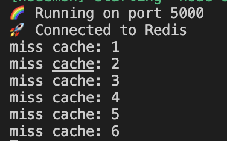

# The Cache Stampede

---

## Getting Started

---

`npm install`

`npm start`

`npm run dev` to start with hot reloading

`npm test`

---

## Tame the Herd 🐘

---

You can test the endpoint using the following route and payload.

**[POST]** `http://localhost:5000/superexpensive/`

Payload

```js
{
  "id": "some_id";
}
```

**[GET]** `http://localhost:5000/superexpensive/clear` - to clear the cache

---

## What is a Cache Stampede?

---

Let's look at an example using a cache and an API endpoint:

Pretend we have an endpoint that does a very expensive operation. It gets called a lot throughout the day and returns the same data for the most part.

A simple solution to prevent this endpoint from getting called too often is to use a cache. That way when 1000s of requests are made, most will hit the cache and speed up the response.

One problem though.

This is a very popular service. At certain times of the day our endpoint can receive 100s of concurrent requests (requests happening at the same time). If the cache is empty at this time we actually get 100s of cache misses since they all look at an empty cache at the same time!

Now these 100s of concurrent requests trigger a very expensive operation which eventually fails from all the requests!


**Check out this video walkthrough:** https://www.loom.com/share/da1e0f4e8a7943f6b1ab1fdccab9d3dc

---

### TODO

---

In this app we have a `superExpensiveController` which calls a `superExpensiveOperation` which returns a response. We cache results in order to not call the `superExpensiveOperation` too often.

**1 problem:**

The Cache Stampede happens every morning at 8AM when our users wake up which results in a ton of cache misses and making our system prone to crashing.

We must solve this.

Run the following script while in `npm run dev` mode.

```bash
curl --header "Content-Type: application/json" \
  --request POST \
  --data '{"id":"stampeding"}' \
  http://localhost:5000/superexpensive/ &
curl --header "Content-Type: application/json" \
  --request POST \
  --data '{"id":"stampeding"}' \
  http://localhost:5000/superexpensive/ &
curl --header "Content-Type: application/json" \
  --request POST \
  --data '{"id":"stampeding"}' \
  http://localhost:5000/superexpensive/ &
curl --header "Content-Type: application/json" \
  --request POST \
  --data '{"id":"stampeding"}' \
  http://localhost:5000/superexpensive/ &
curl --header "Content-Type: application/json" \
  --request POST \
  --data '{"id":"stampeding"}' \
  http://localhost:5000/superexpensive/ &
curl --header "Content-Type: application/json" \
  --request POST \
  --data '{"id":"stampeding"}' \
  http://localhost:5000/superexpensive/

```

This script sends 6 concurrent requests to our controller and you should see:



You need to find a solution so that when a series of concurrent requests reaches the endpoint, they don't all miss the cache.

**To test your solution, after sending the request above make sure you clear the cache by sending a **[GET]** `http://localhost:5000/superexpensive/clear`**

You will know your solution works once you run the script above and see:


Here's some reading on how Instagram solved this problem:

https://instagram-engineering.com/thundering-herds-promises-82191c8af57d

https://en.wikipedia.org/wiki/Cache_stampede

---

### Food for thought && Bonuses

---

1. Make a video/diagram explaining this cache stampede problem
2. What are some libraries which might solve this issue?
3. What is a table-lock? How could this be applied to this problem?
